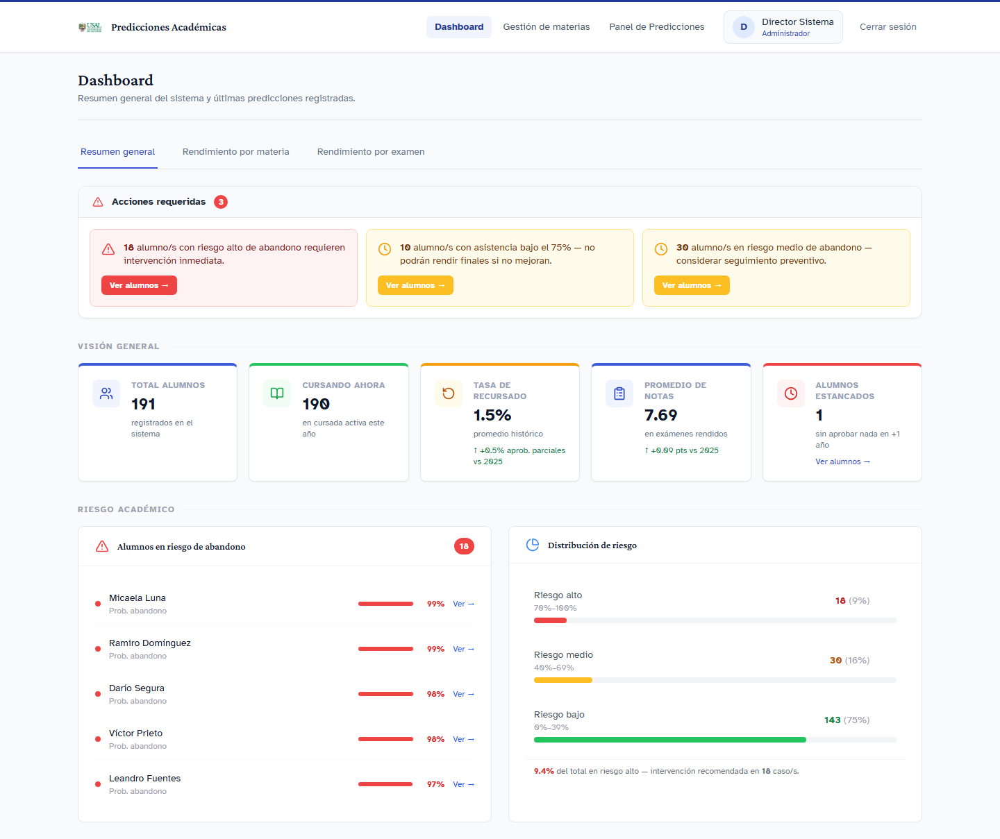
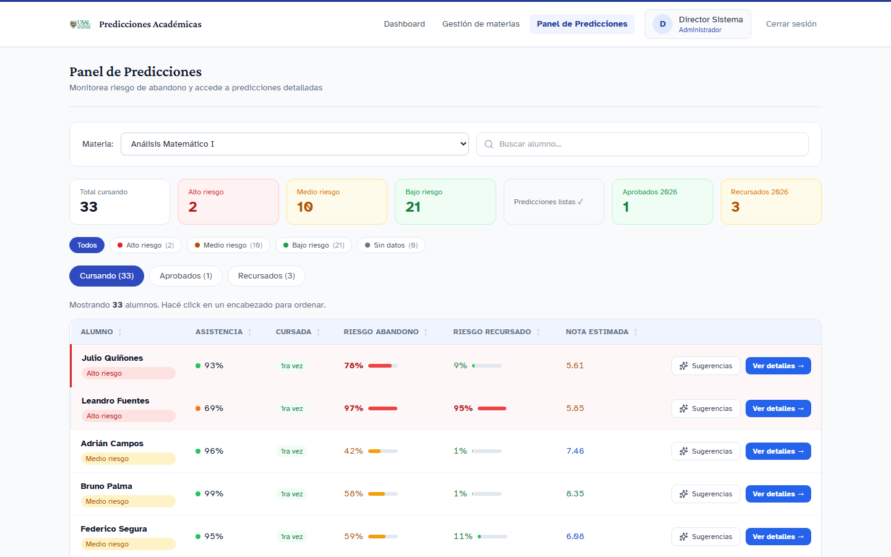
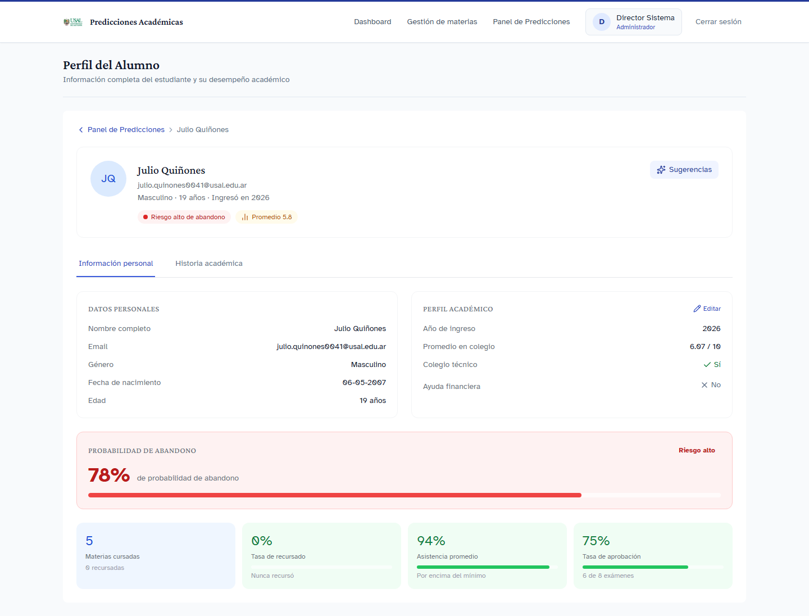
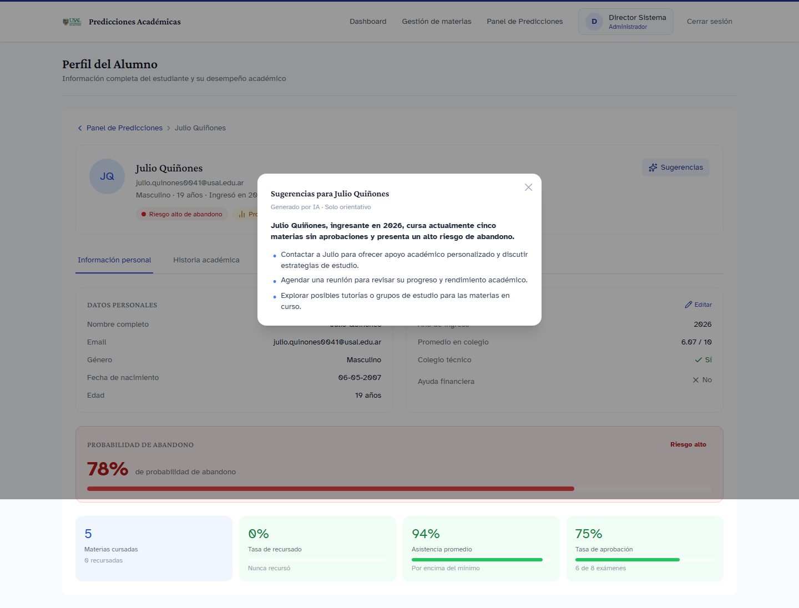
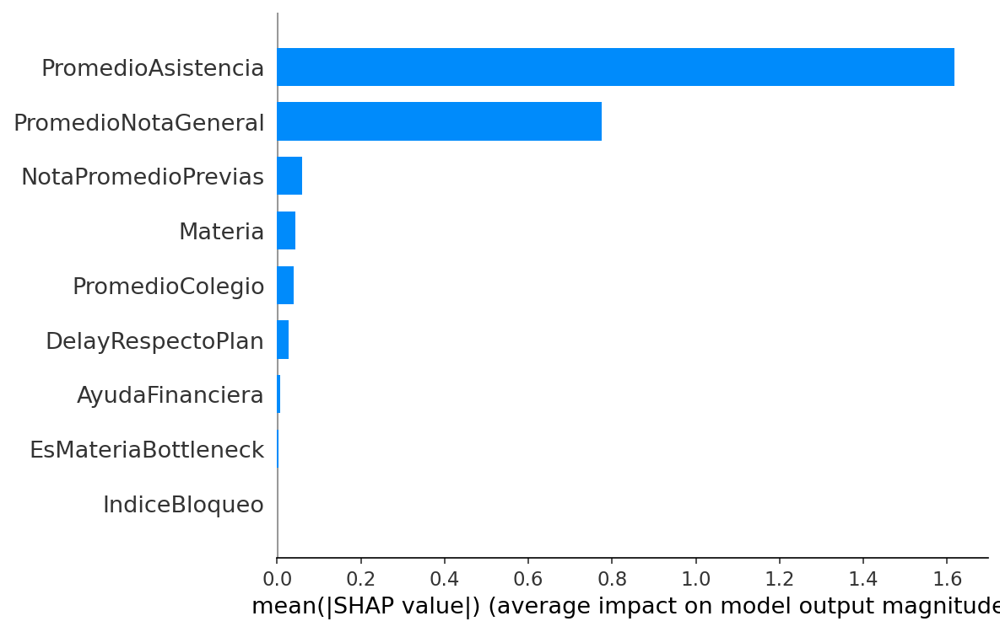
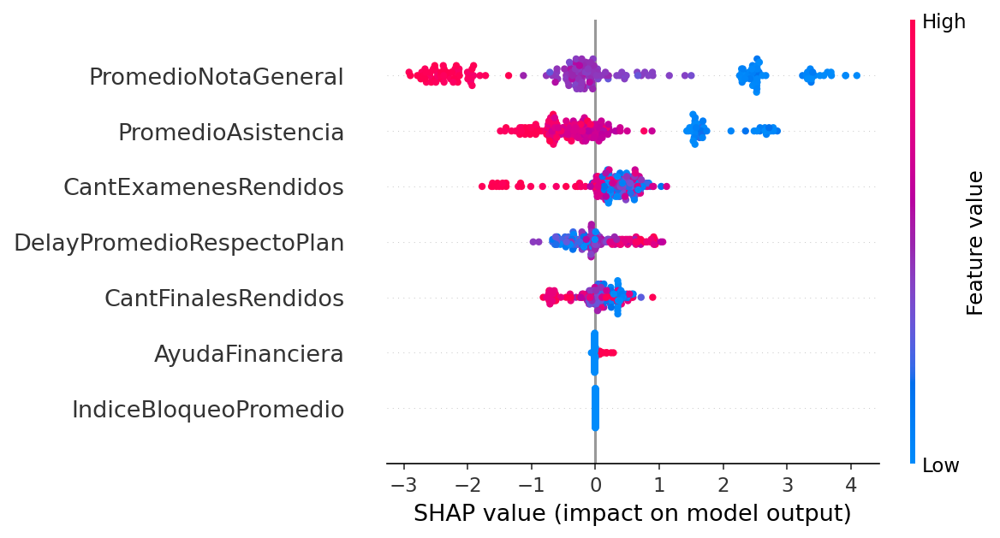
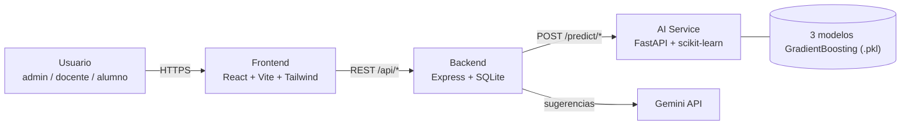

# Predicciones Académicas

[](https://github.com/julian-barbieri/academic-risk-prediction/actions/workflows/tests.yml)
[](LICENSE)
[](https://pf-frontend-1cdz.onrender.com)

Plataforma de gestión académica (notas, inscripciones, roles) con una capa de Machine Learning que predice **abandono de carrera**, **recursada de materias** y **nota de examen** — con explicabilidad de cada predicción y sugerencias generadas con IA.

Full-stack: React + Express + un microservicio de ML en Python, los tres desplegados de forma independiente.

---

## Capturas

| Dashboard | Panel de predicciones |
|---|---|
|  |  |

| Predicción explicada por alumno | Sugerencias generadas con Gemini |
|---|---|
|  |  |

Capturas reales del sistema corriendo contra el AI service desplegado en producción, con datos sintéticos.

---

## Demo en vivo

| Servicio | URL |
|---|---|
| Frontend | https://pf-frontend-1cdz.onrender.com |
| Backend (API) | https://pf-backend-fgg3.onrender.com/health |
| AI Service (predicciones) | https://pf-ai.onrender.com/health |

**Para probarlo**, iniciá sesión con cualquiera de estas cuentas de demo (datos 100% sintéticos, no hay alumnos reales):

| Rol | Usuario | Contraseña |
|---|---|---|
| Administrador/Director | `director` | `director123` |
| Docente | `docente` | `docente123` |

Los tres servicios corren en el plan free de Render, así que si nadie los usó en un rato pueden tardar ~30-50s en la primera respuesta mientras "despiertan". El frontend ya dispara un ping de warmup al AI service al cargar para mitigar esto.

---

## Qué hace

### Gestión académica
- Roles diferenciados (administrador, coordinador, docente, alumno), cada uno con su propia vista y permisos
- Gestión de materias, notas, inscripciones y cursadas
- Autenticación con Google OAuth (dominio institucional) o usuario/contraseña local

### Capa de IA
- **3 modelos** de scikit-learn (GradientBoosting) entrenados para: riesgo de abandono, riesgo de recursada y nota estimada de examen
- **Explicabilidad con SHAP**: cada predicción muestra qué variables la explican y en qué dirección, no es una caja negra
- **Sugerencias accionables generadas con Gemini** a partir de la predicción y el contexto del alumno (ver captura arriba)
- API de predicciones desacoplada (FastAPI), consumida por el backend vía HTTP — se puede reemplazar o escalar sin tocar el resto del sistema

---

## Resultados de los modelos

Métricas calculadas evaluando los modelos entrenados contra sus datasets de test (no vistos durante el entrenamiento):

| Modelo | Tipo | n (test) | Métricas |
|---|---|---|---|
| Abandono de carrera | Clasificación binaria | 200 | ROC-AUC **0.916** · F1 **0.83** · Accuracy 81.5% |
| Recursada de materia | Clasificación binaria | 6.900 | ROC-AUC **0.908** · F1 **0.79** · Accuracy 88.1% |
| Nota de examen | Regresión (escala 0-10) | 15.740 | R² **0.512** · MAE **1.25** |

---

## Explicabilidad (SHAP)

Cada predicción de riesgo se puede descomponer en el aporte de cada variable, para que la explicación no sea "el modelo dice que sí" sino "estos son los factores y su peso":

| Importancia global (materia) | Distribución de aportes (alumno) |
|---|---|
|  |  |

---

## Arquitectura



Los tres servicios se despliegan por separado en Render (frontend estático, backend Node, AI service como contenedor Docker). El dashboard Streamlit con los gráficos SHAP (`ai-service/app/streamlit_app.py`) es una herramienta de análisis exploratorio que corre local — no está expuesta en producción, ahí solo se sirve la API de predicciones.

---

## Stack tecnológico

- **Frontend**: React, Vite, Tailwind CSS, React Router
- **Backend**: Express.js, better-sqlite3, Passport.js (Google OAuth + local), Google Gemini API
- **AI Service**: Python, FastAPI, scikit-learn, SHAP, Streamlit (exploración local)
- **CI/CD**: GitHub Actions (jest + pytest en cada push), Docker, Render

---

## Cómo correrlo local

Requiere Python 3.12, Node 18+ y npm.

```bash
# Backend — http://localhost:3001
cd backend
npm install
npm start

# Frontend — http://localhost:5173
cd frontend
npm install
npm run dev

# AI Service — http://localhost:8000
cd ai-service
python -m venv .venv
./.venv/Scripts/Activate.ps1   # Windows; en Mac/Linux: source .venv/bin/activate
pip install -r requirements.txt
uvicorn src.model_deploy:app --reload
```

Variables de entorno: copiá `backend/.env.example` a `backend/.env` y completá los secrets (Google OAuth, Gemini API key). Sin esas keys, el login con usuario/contraseña local y las predicciones funcionan igual; lo que no anda es el login con Google y las sugerencias con Gemini.

### Estructura del proyecto

```
proyecto-final/
├── frontend/          # React + Vite — interfaz de usuario
├── backend/           # Express + SQLite — API, auth, orquestación
├── ai-service/         # FastAPI + scikit-learn — modelos y predicciones
└── docs/              # specs, planes de implementación, assets
```

---

## Testing y CI

66 tests corriendo en cada push a `main` vía GitHub Actions ([`.github/workflows/tests.yml`](.github/workflows/tests.yml)):

```bash
cd backend && npm test        # 46 tests (jest)
cd ai-service && pytest tests/  # 20 tests (pytest)
```

---

## Sobre los datos

Todos los alumnos, notas e historiales académicos usados para entrenar los modelos y poblar la demo son **sintéticos**, generados con un script propio (`backend/src/db/seed.js`). No hay datos reales de estudiantes en ningún punto del sistema.

---

## Licencia

[MIT](LICENSE) © Julián Barbieri
